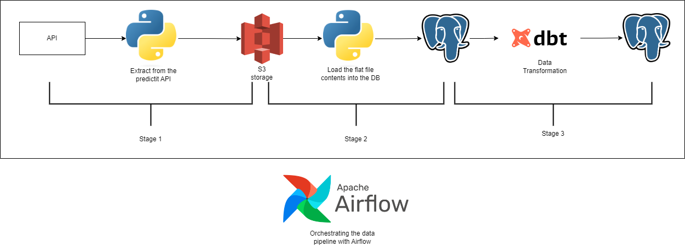

A data pipeline to facilitate data extraction from predictit to the storage in a postgres database.

The data is extracted using predictit API and the raw data is stored in a blob storage.

The raw data is loaded into the database with the file components stored as a string in a single column.

The data is then flattened and transformed using Data Build Tool before the transformed data is stored again in the postgres database.

The entire data pipeline is orchestrated using Airflow deployed using AWS Managed Workflow Airflow Architecture.